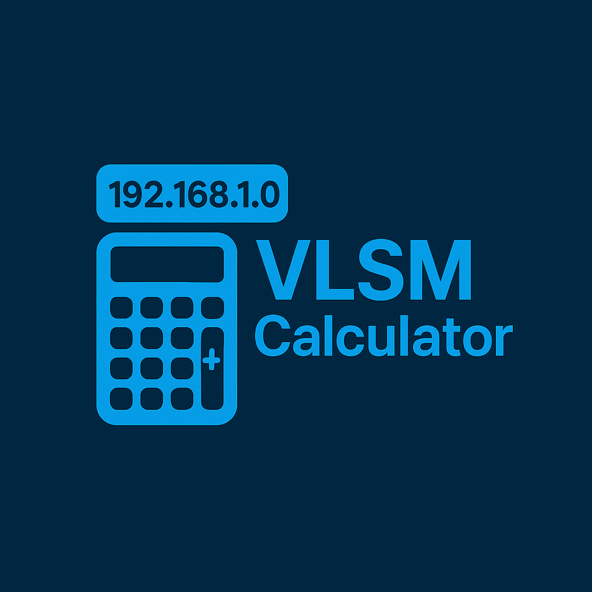

---

```markdown
#  VLSM Calculator V.2 - Aplicación Electron

Una aplicación de escritorio construida con Electron para calcular subredes de longitud variable (VLSM) y aplicar configuraciones automáticamente a servidores Ubuntu.

**Desarrollado por: Dev-Jhojan y Dev-Jhonier**

## Descripción

VLSM Calculator V.2 permite:
- Calcular subredes de longitud variable (VLSM) a partir de una dirección de red
- Visualizar la información detallada de cada subred
- Enviar configuraciones DHCP automáticamente a un servidor Ubuntu
- Guardar y gestionar credenciales de servidores de forma segura
- Detectar automáticamente las interfaces de red en el servidor Ubuntu
- Generar reportes en PDF con la información de las subredes

## Instalación y Ejecución del Ejecutable

### Paso 1: Ejecuta el script de construcción

Abre una terminal en la carpeta raíz de tu proyecto y ejecuta el siguiente comando:

```bash
node scripts/build-app.js
```

Este script:

- Verificará que el logo exista (o lo generará)
- Comprobará que todas las dependencias estén instaladas
- Construirá el ejecutable para Windows

### Paso 2: Encuentra el instalador

Una vez completado el proceso, encontrarás el instalador en la carpeta `dist` con el nombre:

```text
VLSM Calculator V.2-Setup-4.5.0.exe
```

### Alternativa: Construcción manual

Si prefieres ejecutar los comandos manualmente:

1. Asegúrate de tener todas las dependencias instaladas:

```bash
npm install
```

2. Construye la aplicación:

```bash
npm run build
```

---

## Otras Opciones de Ejecución

### Ejecutar en modo portable (sin instalación)

1. **Descarga la versión portable**: Localiza la carpeta `win-unpacked` dentro de `dist`.

2. **Ejecuta la aplicación**: Dentro de la carpeta `win-unpacked`, haz doble clic en el archivo `VLSM Calculator V.2.exe`.

---

## Requisitos del Sistema

- **Sistema Operativo**: Windows 7/8/10/11 (64 bits)
- **Espacio en disco**: Al menos 200 MB libres
- **Memoria RAM**: 2 GB o más recomendado
- **Conexión a red**: Necesaria para conectar con el servidor Ubuntu

## Uso de la Aplicación

### Calculadora VLSM

1. Ingresa la dirección de red (por ejemplo, 172.18.0.0)
2. Especifica el número de subredes
3. Ingresa el número de hosts requeridos para cada subred
4. Haz clic en "Calcular VLSM"
5. Los resultados se mostrarán en la sección inferior
6. Puedes generar un PDF con los resultados haciendo clic en "Generar PDF"

### Configuración del Servidor

1. Ve a la pestaña "Configuración del Servidor"
2. Para detectar las IPs disponibles en tu servidor:
   - Haz clic en "Detectar IPs del Servidor"
   - Ingresa la dirección IP inicial, usuario y contraseña
   - Selecciona la interfaz correcta de la lista de resultados
3. Completa el formulario con la IP seleccionada, usuario y contraseña
4. Haz clic en "Guardar Configuración"
5. Regresa a la pestaña "Calculadora"
6. Después de calcular VLSM, haz clic en "Enviar al Servidor" para aplicar la configuración

## Solución de Problemas

### Problemas de Conexión con la API

1. Asegúrate de que la API local esté ejecutándose en `http://localhost:3001`
2. Verifica que los endpoints `/vlsm/calculate` y `/vlsm/calculate-json` estén disponibles

### Problemas de Conexión SSH

1. Verifica que el servidor esté encendido y accesible en la red
2. Asegúrate de que el servicio SSH esté activo en el servidor
3. Comprueba que no haya firewalls bloqueando la conexión
4. Verifica que las credenciales sean correctas

### Problemas con la Detección de IPs

1. Asegúrate de que las credenciales del servidor sean correctas
2. Verifica que el usuario tenga permisos para ejecutar el comando `ip -o a`
3. Intenta ingresar la IP manualmente

---

## Para Desarrolladores

### Requisitos Previos

- [Node.js](https://nodejs.org/) (v14.0.0 o superior)
- [npm](https://www.npmjs.com/) (incluido con Node.js)
- [Git](https://git-scm.com/) (opcional)

### Instalación desde Código Fuente

1. Clona o descarga este repositorio:

```bash
git clone https://github.com/jhojax12866/FrontVLSM_calculator
cd vlsm-calculator
```

2. Instala las dependencias:

```bash
npm install
```

3. Inicia la aplicación en modo desarrollo:

```bash
npm start
```

---

**Desarrollado con ❤️ por Dev-Jhojan y Dev-Jhonier**
```
